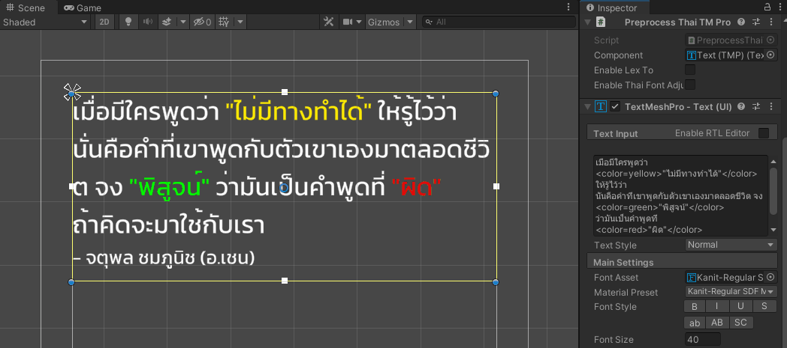

 
<strong>Welcome to LuviKunG's <a href="https://github.com/LuviKunG">Github</a> and <a href="https://gist.github.com/LuviKunG">Gist</a></strong>
 
 

# Repositories

## Tools for Godot Engine

### [LuviConsole for Godot](https://github.com/LuviKunG/GodotLuviConsole)

- light-weighted console for Godot Engine.
- Able to use in-game and editor.
- Able to create custom commands and execute in-game.

## Tools for Unity

### [LuviTools](https://github.com/LuviKunG/LuviTools)

- Various C# Scripts for Unity Engine that helps you to develop the game easier.
- Some scripts may obsolete or dreprecated.

### [Custom Transform Inspector](https://github.com/LuviKunG/CustomTransformInspector)

- Custom a transform inspector in Unity Engine that includes reset position, rotation and scales.

### [Scene Menu Window](https://github.com/LuviKunG/SceneMenuWindow)

- Easier to change scene or access scene.
- Ordering scenes in Build Settings and just open the window and click the scene you want to edit in editor to open it.

### [Scripting Define Symbol Window](https://github.com/LuviKunG/ScriptDefineSymbolsEditor)

- Easier to editing Scripting Define Symbol.
- Able to add, remove and reorder of SDS syntax.
- Deprecated for Unity 2021 or newer version because Unity already include this feature into editor in Player Preference.

### [Graphic Shader Window](https://github.com/LuviKunG/GraphicShaders)

- Easier to check list of shader that will includes in build.
- Contains feature of duplication checking and reordering shaders list.

### [Animation Event Viewer](https://github.com/LuviKunG/AnimationEventViewer)

- Easier to view all events that implemented in animation asset files.
- Preview all AnimationEvent and types.

### [LuviConsole](https://github.com/LuviKunG/LuviConsole)

- A Console GUI that previews all logs, warnings and errors and able to custom your input commands for calling your scripts that implemented in any instances or static classes.
- Using Unity IMGUI.
- Latest update for using in Unity newer version.

## Build Pipeline for Unity

- All Build Pipline has feature to select export build location and will remember the last location you selected.
- Able to change build location everytime.
- Able to set build format name.
- One click and GO Build, just take your time, off from chair and go take some coffee and let Build Pipeline handle build process.

### [Build Pipeline for WebGL](https://github.com/LuviKunG/BuildPipelineWebGL)

- Strip mobile warning for WebGL usage in mobile platform.
- Adjust memory size for WebAssembly.
- Adjust linker target.
- Adjust compression.
- Adjest WASM streaming.

### [Build Pipeline for iOS](https://github.com/LuviKunG/BuildPipelineIOS)

- Adjust info.plist such as permissions.

### [Build Pipeline for Android](https://github.com/LuviKunG/BuildPipelineAndroid)

- Storing key and password for easier to rebuild everytime (but not recommended, just for quick build!).

## Coming Soon!

### Tad Kum Thai Library for Unity Editor

- Reposition Thai alphabet font in the correct position and using correct alphabet.
- Coming with **dictionary block-chained** pattern of all Thai words that able to group phrase and divide word by word (or sentense).
- Able to use custom font by using FontForge Python batch scripts, any font will converted for support GPOS and GSUB.
- required [Unity3D.ThaiFontAdjuster](https://github.com/SaladLab/Unity3D.ThaiFontAdjuster) from [SaladLab](https://github.com/SaladLab), [FontForge](https://fontforge.org/en-US/) and [TextMeshPro](https://docs.unity3d.com/Manual/com.unity.textmeshpro.html) from Unity Engine Package.

### Scenario Engine (for Unity Editor)

- Graph Nodes style that help you to manage story and dialogue or some event such as camera repositioning or shaking, etc.
- Based on Finite State Machine with Entry and Exit point.
- Easy to integration. No need to create custom editor. Just create an inherit class and go.

### Scenario Engine (for Godot Engine)

- Graph Nodes style that help you to manage story and dialogue or some event such as camera repositioning or shaking, etc.
- Based on logic driven pattern.

# Profile

Full name: **Thanut Panichyotai**

Titles: **Game Director, Senior Game Designer & Senior Game Developer**

Location: **Bangkok, Thailand.**

## Summary

Passionate game designer with 9 years of experience across mobile, AAA, and XR. Led game development teams to successful launches, leveraging Agile and OKR methodologies. Strong programming skills in Unity (C#) and Unreal Engine (C++). Adept at crafting compelling pitches, design documents, and prototypes. Analyze games with cutting-edge tools and generate insightful reports. Experienced author of gaming journals. Collaborative and resourceful, known for innovative solutions and exceeding expectations.

## Skill Sets

### Game Development

- Able to create games using a variety of game engines. Expertise on coding in game development, utilizing C#, C++, Javascript, and Typescript.
- Experience using Firebase to integrate online projects that sync with real-time databases, cloud firestores, cloud functions, and firebase messaging.
- Knowledge of utilizing sockets to construct online multiplayer games.
- Knowledge in creating VR projects in Unreal Engine 4 and Unreal Engine 5 with a customized engine capable of developing games in a VR environment.
- Experience in creating PC games (Steam) and mobile games.
- Strong knowledge of Object-Oriented programming, SOLID programming and game development structure.
- Understanding of game optimization from coding, structuring and using game engine tools such as occlusion culling, static mesh baking, shaders improvements, light probes, reflect probes, etc.
- Able to oversee game development, manage the product roadmap and development pipeline with teams, and implement in-house tools to facilitate work more quickly.

### Game Design

- Knowledge of documenting a full game design document which includes all the possible information for game development.
- Able to construct the game prototype by myself for testing core game loops or game feels.
- Experience of using ‘A Deck of Lenses’ from ‘The Art of Game Design: A Book of Lenses’ that is efficient for designing a game.
- Strong knowledge of using cell documents with functions such as Microsoft Excel or Google Spreadsheet to calculate or program the formula.

### Game Arts & Performances

- Experience in creating concept arts, key visuals, vertical slices of the game.
- Understanding of the design UX/UI element of the game.
- Experience in modeling and model optimization that leads to game optimization such as meshes baking,
- Understanding of cinematic scenery in the game and how to improve performances includes lighting, baking light maps, using light probes, reflect probes, fake light or rim light and normals for 2D rim lights.
- Understanding of colors theory, 12 principles of animations, curves and easing.

### Programming Capabilities

- Unity Engine 4, 5, 2017, 2018, 2019, 2020, 2021 & 2022
- Unreal Engine 4.27, 5.0 and newer
- Construct 2 (2D Game Engine for WebGL or Browser game)
- Defold
- Pixi.js
- C# with OOP (SOLID Included)
- C++ (Unreal & Arduino)
- Ruby Script
- Java
- Javascript
- JSLib (Unity)
- HTML
- PHP
- SQL (Query)
- MongoDB
- 3rd Party Server Provider (Parse (Legacy), GameSparks, PlayFab)
- Multiplayer & Back-end Provider(GameSparks, Playfab, Photon)
- Node.js
- WebSocket & Socket.IO
- React.js
- IMGUI

### Other

- Progressive Web App Design (Which include Web Design and App Design)
- UX/UI Design & Color Theory

## Certifies

- Certified on Unity Certified Developer (2016).
- Instructor of ICT Basic Training for SMEs in Microsoft Youth Spark & ASEAN Foundation.
- 2nd Winner Prize competition from Good Game Developer Project 2013.
- Teacher Assistance of Ministry of information and Communication Technology about Technology for Accessibility.

## Working Experience

### Nomadic Games Co,.Ltd. Aug 2023 - Present

**Lead Game Programmer**

Led AAA action martial arts game design, crafting diverse combat systems with unique moves and skills. Managed development of a Chinese martial arts game using Unreal Engine 5 and C++. Drove project lifecycle from prototype to production phase

### NANUQ Co,.Ltd. Mar 2023 - Sep 2023

**Lead and Senior Game Developer**

Created cinematic scenes for advertising using Unreal Engine 5. Oversaw two online mobile game projects, offering key insights to the product owner on project development costs and quality.

### Miimo AI Co,.Ltd. Feb 2022 - Feb 2023

**Game Developer**

Developed iOS low-code educational game for children. Designed Unity editors/tools, including stages and instructional sequence nodes. Led iOS to Android migration with optimizations and native button support

### Casasoft Studio Co,.Ltd. Feb 2021 - Feb 2022

**Senior Game Developer**

Developed two soul-like action game prototypes in Unreal Engine 4, using C++ and Blueprint. Employed Scrum-based Agile Project Management for effective oversight. Mentored and trained intern programmer and junior developer in game development.

### Vonder (Thailand) Co.,Ltd. Oct 2019 - Feb 2021

**Senior Game Designer & Senior Game Developer**

Designed and developed three Unity WebGL games. Managed public relations for company projects. Mentored junior developers. Provided strategic counsel on project cost and quality to leadership.

### Zai Studio June 2019 - Oct 2019

**Senior Game Developer**

Designed and developed a multiplayer mini-game project. Managed public relations for interactive projects.

### ZERO-bit Co.,Ltd. May 2018 - February 2019

**Game Director, Game Designer, Senior Game Developer & Marketing Coordinator**

Directed and designed seven mobile games, overseeing the full development process. Managed projects using Objective and Key Result Management System for organizational alignment.

### YGGDrazil Group Co., Ltd. June 2016 - May 2018

**Game Designer & AI Game Developer, with a liitle bit of Project Management**

Designed and developed VR game "NUMBER 6" for HTC Vive and KAT VR. Created mobile VR game "NUMBER 5" for Android, iOS, and Oculus. Contributed as AI Game Developer for PC game "Home Sweet Home: EP.1"

### arkavis siam Co., Ltd. May 2014 - January 2016

**Game Developer**

Developed frontend and backend for 3 games. RETRO WINGS, RAMA RUN and ZOMBIE RUSH.

### Kasetsart University 2011

**Web Programmer**

Developed a website of Kasetsart University, Faculty of Agriculture for Master degree online registration using PHP to create printable document as PDF file.

## Activities

- Moderator of Thai Game Industry Career (TGIC).
- Certified on Unity Certified Developer 2016.
- 1st Winner Prize of Popular Vote from Good Game Developer Project 2013.
- 2nd Winner Prize of competition from Good Game Developer Project 2013.
- 2nd Winner Prize of Popular Vote from Thai Game Jam 2013.
- Founder & Moderator of 4DBox Group.
- Youtube Partnership on irpgTV channel, aiming for review games in Thailand.
- Twitch Livestream partner.
- Teacher Assistance of Ministry of information and Communication Technology.

## Previous Works

### Home Sweet Home EP.1

**Thai Mythology horror game**

- Worked as AI Game Developer, developed for all ghosts in the game and some mini puzzle mechanics.
- Developed using Unreal Engine 4.17, based on blueprint.
- Available for purchase on Steam.

### NUNBER 5

**Virtual-reality of First person action shooting in mobile**

- Worked as Game Designer and Game Developer.
- Using Unity Engine 5.6.5.
- Support on Oculus GearVR and Cardboard (both Android and iOS).
- Available for purchase on Oculus (Gear VR).

### RETRO WINGS (2015 - 2016)

**Arcade mobile platfrom game**

- This game has 100,000 - 500,000 downloads in China in a month.
- Has a different version called RETRO WINGS LITE available for HTML5.
- Using Unity Engine 4.6.
- Available for free on iOS and Android.

### RAMA RUN (2016)

**Arcade mobile platfrom game**

- Worked as User Interface Developer.
- Using Unity Engine 4.6.
- Available for free on Android.

### Flappy LuviKunG (2014)

**Just a normal 'Flappy Bird' clone game**

- This game has been created in 6 hours, with touch screen supported.
- Inspired by Flappy Bird, But much easier to play.
- Using Construct 2 with pure blueprint events.
- This game got 10,000 download in first day.
- Available download for free on [Mediafire](http://www.mediafire.com/file/6q7zd7tpkfwxusj/Frappy_LuviKunG.rar/file).

### Color My Heart (2013)

**Psychological adventure game**

- Won 2nd Prize of Popular Vote from Thai Game Jam 2013.
- Using RPG Maker XP with Ruby Script.
- Available download for free on [Global Game Jam Achieved Website (2013)](http://2013-server.globalgamejam.org/2013/color-my-heart)

## Other works

### Home Sweet Home EP.2

**Thai Mythology horror game**

- Started a prototype using Unreal Engine 4.22.
- Exit the prototype team later, and start 'NUMBER 6' project.

### NUMBER 6

**Virtual-reality of First person action shooting using HTC Vive**

- Developed using Unreal Engine 4.22 which internal customize engine called 'Thor' for VR Games.
- Developed motion tracking system which able to grab stuff and throw, shoot the gun and using light saber to deflect an incoming bullets.
- Designed and developed during development process.
- This project isn't finish and canceled by Game Director.

# Contacts

- [Facebook](https://www.facebook.com/LuviKunG/)
- [LinkedIn](https://www.linkedin.com/in/luvikung/)
- [Twitter](https://twitter.com/luvikung)
- [YouTube Channel](https://www.youtube.com/user/luvikungTV)
