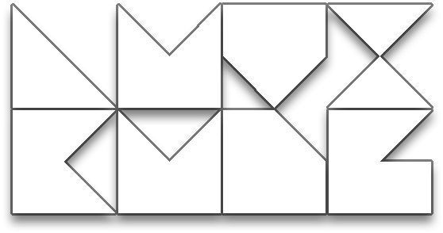

 
<strong>Welcome to LuviKunG's <a href="https://github.com/LuviKunG">GitHub</a></strong>
 
<a href="https://luvikung.github.io">Website</a> | <a href="https://gist.github.com/LuviKunG">Gist</a>

# Repositories

## General Tools

### [Texture Manipulator](https://github.com/LuviKunG/texture-manipulator)

- A simple web app that allows you to manipulate image channels such as separating RGBA channels, combining channels into one image, resizing images, and converting image formats.
- Comes with installation files for Windows.
- Open source for building your own version with different platform support.

## Tools for Godot Engine

### [LuviConsole for Godot (Beta)](https://github.com/LuviKunG/GodotLuviConsole)

- Lightweight console for Godot Engine.
- Usable in-game and in the editor.
- Allows you to create custom commands and execute them in-game.

## Tools for Unity (Out of Support)

### [LuviTools](https://github.com/LuviKunG/LuviTools)

- Various C# scripts for Unity Engine that help you develop games more easily.
- Some scripts may be obsolete or deprecated.

### [Custom Transform Inspector](https://github.com/LuviKunG/CustomTransformInspector)

- Customizes the transform inspector in Unity Engine to include resetting position, rotation, and scale.

### [Scene Menu Window](https://github.com/LuviKunG/SceneMenuWindow)

- Makes it easier to change or access scenes.
- Allows you to order scenes in Build Settings; just open the window and click the scene you want to edit in the editor to open it.

### [Scripting Define Symbol Window](https://github.com/LuviKunG/ScriptDefineSymbolsEditor)

- Simplifies editing Scripting Define Symbols.
- Allows you to add, remove, and reorder SDS syntax.
- Deprecated for Unity 2021 or newer because Unity already includes this feature in the Player Preferences editor.

### [Graphic Shader Window](https://github.com/LuviKunG/GraphicShaders)

- Makes it easier to check the list of shaders that will be included in the build.
- Includes features such as duplicate checking and reordering of the shader list.

### [Animation Event Viewer](https://github.com/LuviKunG/AnimationEventViewer)

- Makes it easier to view all events implemented in animation asset files.
- Previews all AnimationEvents and their types.

### [LuviConsole](https://github.com/LuviKunG/LuviConsole)

- A console GUI that previews all logs, warnings, and errors, and allows you to customize input commands to call scripts implemented in any instances or static classes.
- Uses Unity IMGUI.
- Updated for use in newer versions of Unity.

## Build Pipeline for Unity (Out of Support)

- All build pipelines feature the ability to select an export build location, and they will remember the last location you selected.
- Allows you to change the build location every time.
- Allows you to set the build format name.
- With one click, the build pipeline takes over so you can take a break, grab some coffee, and let it handle the build process.

### [Build Pipeline for WebGL](https://github.com/LuviKunG/BuildPipelineWebGL)

- Strips mobile warnings for WebGL usage on mobile platforms.
- Adjusts memory size for WebAssembly.
- Adjusts linker target.
- Adjusts compression.
- Adjusts WASM streaming.

### [Build Pipeline for iOS](https://github.com/LuviKunG/BuildPipelineIOS)

- Adjusts the info.plist file, including permissions.

### [Build Pipeline for Android](https://github.com/LuviKunG/BuildPipelineAndroid)

- Stores keys and passwords for quicker rebuilds (not recommended for production, just for quick builds).

## Upcoming Tools

### Scenario Engine (for Unity Editor)

- Graph node style that helps you manage story, dialogue, or events such as camera repositioning or shaking.
- Based on a finite state machine with entry and exit points.
- Easy to integrate. No need to create a custom editor—just create a subclass and go.

### Scenario Engine (for Godot Engine)

- Graph node style that helps you manage story, dialogue, or events such as camera repositioning or shaking.
- Based on a logic-driven pattern.

# Profile

Full name: **Thanut Panichyotai**

Titles: **Game Director, Senior Game Designer & Senior Game Developer**

Location: **Bangkok, Thailand**

## Summary

Passionate game designer with 9 years of experience across mobile, AAA, and XR. Led game development teams to successful launches by leveraging Agile and OKR methodologies. Possesses strong programming skills in Unity (C#) and Unreal Engine (C++). Adept at crafting compelling pitches, design documents, and prototypes. Skilled in analyzing games with cutting-edge tools and generating insightful reports. An experienced author of gaming journals, collaborative and resourceful—known for innovative solutions and exceeding expectations.

## Skill Sets

### Game Development

- Capable of creating games using a variety of game engines. Expertise in coding for game development using C#, C++, JavaScript, and TypeScript.
- Experience using Firebase to integrate online projects that sync with real-time databases, Cloud Firestore, Cloud Functions, and Firebase Messaging.
- Knowledge in utilizing sockets to construct online multiplayer games.
- Experience in creating VR projects in Unreal Engine 4 and 5 using a customized engine designed for VR game development.
- Experience in creating PC (Steam) and mobile games.
- Strong knowledge of object-oriented programming, SOLID principles, and game development structures.
- Understanding of game optimization through coding, structuring, and using game engine tools such as occlusion culling, static mesh baking, shader improvements, light probes, reflection probes, etc.
- Capable of overseeing game development, managing product roadmaps and development pipelines with teams, and implementing in-house tools to expedite work.

### Game Design

- Experienced in creating comprehensive game design documents that include all necessary information for development.
- Capable of constructing game prototypes independently for testing core game loops and feel.
- Experience using *A Deck of Lenses* from *The Art of Game Design: A Book of Lenses* to design games effectively.
- Proficient in using spreadsheet tools such as Microsoft Excel or Google Sheets to calculate formulas or program logic.

### Game Arts & Performances

- Experience in creating concept art, key visuals, and vertical slices of games.
- Understanding of game UX/UI design elements.
- Experience in modeling and model optimization for improved game performance, such as mesh baking.
- Knowledge of cinematic game environments and how to improve performance through lighting, light map baking, using light probes, reflection probes, fake lighting or rim lighting, and normals for 2D rim effects.
- Understanding of color theory, the 12 principles of animation, and the use of curves and easing.

### Programming Capabilities

- Unity Engine 4, 5, 2017, 2018, 2019, 2020, 2021 & 2022
- Unreal Engine 4.27, 5.0 and newer
- Construct 2 (2D game engine for WebGL or browser games)
- Defold
- Pixi.js
- C# with OOP (SOLID included)
- C++ (Unreal & Arduino)
- Ruby Script
- Java
- JavaScript
- JSLib (Unity)
- HTML
- PHP
- SQL (query)
- MongoDB
- Sockets (TCP)
- Third-party server providers (Parse (Legacy), GameSparks, PlayFab)
- Multiplayer & back-end providers (GameSparks, PlayFab, Photon)
- Unreal multiplayer replication system
- Node.js
- WebSocket & Socket.IO
- React.js
- Next.js
- IMGUI

### Other

- Progressive Web App design (including web and app design)
- UX/UI design & color theory

## Certifies

- Certified Unity Developer (2016).
- Instructor for ICT Basic Training for SMEs under Microsoft Youth Spark & ASEAN Foundation.
- Second Prize Winner at the Good Game Developer Project 2013.
- Teaching Assistant for the Ministry of Information and Communication Technology on Technology for Accessibility.

## Working Experience

### Idyllias LLC (Nov 2025 - Present)

**Senior Game Engineer - Unreal Engine**

Develop games using Unreal Engine 5 and C++. Lead and mentor team members in best practices and efficient coding techniques. Collaborate with the design team to implement game features and mechanics. Optimize game performance and ensure a smooth player experience.

### Translucia LLC (Sep 2024 - Oct 2025)

**Senior Game Engineer - Unreal Engine**

Develop an immersive experience using Unreal Engine 5. Create a tech spike to explore new technologies and innovations for the company. Collaborate on product design throughout the development process.

### Nomadic Games Co., Ltd. (Aug 2023 - Aug 2024)

**Lead Game Programmer**

Led AAA action martial arts game design, crafting diverse combat systems with unique moves and skills. Managed the development of a Chinese martial arts game using Unreal Engine 5 and C++. Drove the project lifecycle from prototype to production.

### NANUQ Co., Ltd. (Mar 2023 - Sep 2023)

**Lead and Senior Game Developer**

Created cinematic scenes for advertising using Unreal Engine 5. Oversaw two online mobile game projects, providing key insights to the product owner on project development costs and quality.

### Miimo AI Co., Ltd. (Feb 2022 - Feb 2023)

**Game Developer**

Developed an iOS low-code educational game for children. Designed Unity editors/tools, including stages and instructional sequence nodes. Led the migration from iOS to Android with optimizations and native button support.

### Casasoft Studio Co., Ltd. (Feb 2021 - Feb 2022)

**Senior Game Developer**

Developed two soul-like action game prototypes in Unreal Engine 4 using C++ and Blueprints. Employed Scrum-based Agile Project Management for effective oversight. Mentored and trained an intern programmer and junior developer in game development.

### Vonder (Thailand) Co., Ltd. (Oct 2019 - Feb 2021)

**Senior Game Designer & Senior Game Developer**

Designed and developed three Unity WebGL games. Managed public relations for company projects. Mentored junior developers and provided strategic counsel on project cost and quality to leadership.

### Zai Studio (June 2019 - Oct 2019)

**Senior Game Developer**

Designed and developed a multiplayer mini-game project. Managed public relations for interactive projects.

### ZERO-bit Co., Ltd. (May 2018 - Feb 2019)

**Game Director, Game Designer, Senior Game Developer & Marketing Coordinator**

Directed and designed seven mobile games, overseeing the full development process. Managed projects using an Objective and Key Result Management System for organizational alignment.

### YGGDrazil Group Co., Ltd. (June 2016 - May 2018)

**Game Designer & AI Game Developer, with a bit of Project Management**

Designed and developed the VR game "NUMBER 6" for HTC Vive and KAT VR. Created the mobile VR game "NUMBER 5" for Android, iOS, and Oculus. Contributed as an AI Game Developer for the PC game "Home Sweet Home: EP.1".

### arkavis siam Co., Ltd. (May 2014 - Jan 2016)

**Game Developer**

Developed the frontend and backend for three games: RETRO WINGS, RAMA RUN, and ZOMBIE RUSH.

### Kasetsart University (2011)

**Web Programmer**

Developed a website for Kasetsart University, Faculty of Agriculture, for Master's degree online registration using PHP to generate printable documents in PDF format.

## Activities

- Moderator of Thai Game Industry Career (TGIC).
- Certified Unity Developer (2016).
- First Prize Winner for the Popular Vote at the Good Game Developer Project 2013.
- Second Prize Winner at the Good Game Developer Project 2013.
- Second Prize Winner for the Popular Vote at Thai Game Jam 2013.
- Founder & Moderator of 4DBox Group.
- YouTube partner on the irpgTV channel, which focuses on game reviews in Thailand.
- Twitch livestream partner.
- Teaching Assistant for the Ministry of Information and Communication Technology.

## Previous Works

### Home Sweet Home EP.1

**Thai Mythology Horror Game**

- Worked as an AI Game Developer; developed all ghost characters and implemented some mini puzzle mechanics.
- Developed using Unreal Engine 4.17 and Blueprints.
- Available for purchase on Steam.

### NUMBER 5

**Virtual Reality First-Person Action Shooter for Mobile**

- Worked as Game Designer and Game Developer.
- Developed using Unity Engine 5.6.5.
- Supported on Oculus GearVR and Cardboard (for both Android and iOS).
- Available for purchase on Oculus (Gear VR).

### RETRO WINGS (2015 - 2016)

**Arcade Mobile Platform Game**

- Achieved 100,000 to 500,000 downloads in China within a month.
- There is a different version called RETRO WINGS LITE available for HTML5.
- Developed using Unity Engine 4.6.
- Available for free on iOS and Android.

### RAMA RUN (2016)

**Arcade Mobile Platform Game**

- Worked as a User Interface Developer.
- Developed using Unity Engine 4.6.
- Available for free on Android.

### Flappy LuviKunG (2014)

**A Simple 'Flappy Bird' Clone Game**

- Created in 6 hours and supports touch screens.
- Inspired by Flappy Bird, but much easier to play.
- Developed using Construct 2 with event-based logic.
- Received 10,000 downloads on its first day.
- Available for free download on [Mediafire](http://www.mediafire.com/file/6q7zd7tpkfwxusj/Frappy_LuviKunG.rar/file).

### Color My Heart (2013)

**Psychological Adventure Game**

- Won Second Prize for Popular Vote at Thai Game Jam 2013.
- Developed using RPG Maker XP with Ruby Script.
- Available for free download on the [Global Game Jam Achieved Website (2013)](http://2013-server.globalgamejam.org/2013/color-my-heart).

## Other Works

### Home Sweet Home EP.2

**Thai Mythology Horror Game**

- Started as a prototype using Unreal Engine 4.22.
- Exited the prototype team later, and started the "NUMBER 6" project.

### NUMBER 6

**Virtual Reality First-Person Action Shooter using HTC Vive**

- Developed using Unreal Engine 4.22 with an internally customized engine called "Thor" for VR games.
- Developed a motion tracking system that allows grabbing objects, throwing them, shooting, and using a lightsaber to deflect incoming bullets.
- Designed and developed during the project.
- This project was not finished and was canceled by the Game Director.

# Contacts

- [Facebook](https://www.facebook.com/LuviKunG/)
- [LinkedIn](https://www.linkedin.com/in/luvikung/)
- [Twitter](https://twitter.com/luvikung)
- [YouTube Channel](https://www.youtube.com/user/luvikungTV)