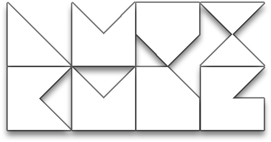

 
<strong>Welcome to LuviKunG's <a href="https://github.com/LuviKunG">GitHub</a></strong>
 
<a href="https://luvikung.github.io">Website</a> | <a href="https://gist.github.com/LuviKunG">Gist</a>

---

# Repositories

## General Tools

### [Texture Manipulator](https://github.com/LuviKunG/texture-manipulator)

- A simple web app that allows you to manipulate image channels such as separating RGBA channels, combining channels into one image, resizing images, and converting image formats.
- Comes with installation files for Windows.
- Open source for building your own version with different platform support.

## Tools for Godot Engine

### [LuviConsole for Godot (Beta)](https://github.com/LuviKunG/GodotLuviConsole)

- Lightweight console for Godot Engine.
- Usable in-game and in the editor.
- Allows you to create custom commands and execute them in-game.

## Tools for Unity

### [LuviInspector](https://github.com/LuviKunG/LuviInspector)

- An alternative inspector for Unity 6+, inspired by Unreal Engine's UPROPERTY macro.
- Apply a single attribute to a class and use a small set of attributes to group fields into collapsible categories, override labels, add editor buttons, conditionally show or hide fields, and annotate them with help notes.

### [LuviTools](https://github.com/LuviKunG/LuviTools) (Out of Support)

- Various C# scripts for Unity Engine that help you develop games more easily.
- Some scripts may be obsolete or deprecated.

### [Custom Transform Inspector](https://github.com/LuviKunG/CustomTransformInspector)

- Customizes the transform inspector in Unity Engine to include resetting position, rotation, and scale.

### [Scene Menu Window](https://github.com/LuviKunG/SceneMenuWindow)

- Makes it easier to change or access scenes.
- Allows you to order scenes in Build Settings; just open the window and click the scene you want to edit in the editor to open it.

### [Scripting Define Symbol Window](https://github.com/LuviKunG/ScriptDefineSymbolsEditor)

- Simplifies editing Scripting Define Symbols.
- Allows you to add, remove, and reorder SDS syntax.
- Deprecated for Unity 2021 or newer because Unity already includes this feature in the Player Preferences editor.

### [Graphic Shader Window](https://github.com/LuviKunG/GraphicShaders) (Out of Support)

- Makes it easier to check the list of shaders that will be included in the build.
- Includes features such as duplicate checking and reordering of the shader list.

### [Animation Event Viewer](https://github.com/LuviKunG/AnimationEventViewer) (Out of Support)

- Makes it easier to view all events implemented in animation asset files.
- Previews all AnimationEvents and their types.

### [LuviConsole](https://github.com/LuviKunG/LuviConsole)

- A console GUI that previews all logs, warnings, and errors, and allows you to customize input commands to call scripts implemented in any instances or static classes.
- Uses Unity IMGUI.
- Updated for use in newer versions of Unity.

## Build Pipeline for Unity (Out of Support)

- All build pipelines feature the ability to select an export build location, and they will remember the last location you selected.
- Allows you to change the build location every time.
- Allows you to set the build format name.
- With one click, the build pipeline takes over so you can take a break, grab some coffee, and let it handle the build process.

### [Build Pipeline for WebGL](https://github.com/LuviKunG/BuildPipelineWebGL) (Out of Support)

- Strips mobile warnings for WebGL usage on mobile platforms.
- Adjusts memory size for WebAssembly.
- Adjusts linker target.
- Adjusts compression.
- Adjusts WASM streaming.

### [Build Pipeline for iOS](https://github.com/LuviKunG/BuildPipelineIOS) (Out of Support)

- Adjusts the info.plist file, including permissions.

### [Build Pipeline for Android](https://github.com/LuviKunG/BuildPipelineAndroid) (Out of Support)

- Stores keys and passwords for quicker rebuilds (not recommended for production, just for quick builds).

## Upcoming Tools

### Scenario Engine (for Unity Editor)

- Graph node style that helps you manage story, dialogue, or events such as camera repositioning or shaking.
- Based on a finite state machine with entry and exit points.
- Easy to integrate. No need to create a custom editor—just create a subclass and go.

### Scenario Engine (for Godot Engine)

- Graph node style that helps you manage story, dialogue, or events such as camera repositioning or shaking.
- Based on a logic-driven pattern.

---

# Profile

Full name: **Thanut Panichyotai**

Titles: **Game Director, Senior Game Designer & Senior Game Developer**

Location: **Bangkok, Thailand**

## Summary

Highly passionate and results-oriented Game Designer with 13 years of experience across mobile, AAA, and XR platforms. Proven leader of game development teams, successfully guiding projects from concept to launch through the effective implementation of Agile and OKR methodologies. Proficient in Unity (C#), Unreal Engine (C++) and Godot (GDScript) with a strong aptitude for developing compelling pitches, comprehensive design documents, and functional prototypes. Expert in utilizing cutting-edge analytical tools to generate insightful reports. An accomplished author of gaming journals, I am a collaborative and resourceful professional, consistently delivering innovative solutions and exceeding project expectations.

---

## Skill Sets

### Game Development

- Able to create games using a variety of game engines, with expertise in coding utilizing C#, C++, JavaScript, and TypeScript.
- Experience using Firebase to integrate online projects that sync with real-time databases, Cloud Firestore, Cloud Functions, and Firebase Messaging.
- Experience utilizing sockets to construct online multiplayer games.
- Experience in creating VR projects in Unreal Engine 4 and Unreal Engine 5 with a customized engine capable of developing games in a VR environment.
- Experience in creating PC games (Steam) and mobile games.
- Strong knowledge of Object-Oriented programming, SOLID programming principles, and game development structure.
- Understanding of game optimization through coding, structuring, and using game engine tools such as occlusion culling, static mesh baking, shader improvements, light probes, reflect probes, etc.
- Able to oversee game development, manage the product roadmap and development pipeline with teams, and implement in-house tools to facilitate work more efficiently.

### Game Design

- Proficient in documenting comprehensive game design documents covering all aspects of game development.
- Able to independently construct game prototypes for testing core game loops and game feel.
- Experience using 'A Deck of Lenses' from 'The Art of Game Design: A Book of Lenses' for efficient game design.
- Strong knowledge of using spreadsheet tools such as Microsoft Excel or Google Sheets to calculate or program formulas.

### Game Arts & Performances

- Experience in creating concept art, key visuals, and vertical slices of the game.
- Understanding of UX/UI design elements within games.
- Experience in modeling and model optimization that leads to game optimization, such as mesh baking.
- Understanding of cinematic composition in games and how to improve visual performance, including lighting, baking light maps, using light probes, reflect probes, fake light or rim light, and normals for 2D rim lights.
- Understanding of color theory, the 12 principles of animation, curves, and easing.

---

## SKILLS

### Game Design

- The Art of Game Design: A Book of Lenses (2nd and 3rd Edition) with A Deck of Lenses
- A Theory of Fun for Game Design
- FREE-TO-PLAY: Making Money from Games You Give Away
- Value Proposition Design

### Arts

- Spine (2D Animation)
- Paint Tool SAI (2D Arts)
- Adobe Photoshop (2D & 3D Texture Painting)
- Adobe After Effects (Promo Video Creation)
- Adobe InDesign (Document & Promotion)
- Blender (3D Models)
- Autodesk Sketchbook (Whiteboxing, Drawing & Prototyping)

### Leads and Pipeline

- Git (GitHub, Gitea)
- Subversion (TortoiseSVN)
- Jira
- YouTrack
- Trello
- Notion
- Figma

### Developments and Programming

- Unity (LTS)
- Unreal Engine 5
- Godot
- Construct 2 and 3
- Defold
- PixiJS
- Three.js
- C# with .NET (for Unity)
- C++ (for Unreal Engine 5)
- GDScript (Godot)
- Java
- JavaScript & TypeScript
- GoLang
- Rust
- Node.js
- Next.js
- JSLib (Unity)
- HTML, CSS, TailwindCSS
- PHP (Legacy)
- SQL (Query)
- MongoDB
- Firebase (Cloud Functions, Realtime Database, Firestore, Messaging)
- Multiplayer & Back-end Provider (GameSparks, PlayFab, Photon)
- Mirror Networking (Multiplayer Games)
- Socket and WebSocket (Socket.IO)

---

## CERTIFICATIONS

- Certified Unity Certified Developer (2016)
- Instructor of ICT Basic Training for SMEs in Microsoft YouthSpark & ASEAN Foundation
- 2nd Prize Winner at Thai Game Jam 2013
- 2nd Prize Winner at Good Game Developer Project 2013
- Certified by the Ministry of Information and Communication Technology on Accessibility Technology in 2011

---

# Contacts

- [Facebook](https://www.facebook.com/LuviKunG/)
- [LinkedIn](https://www.linkedin.com/in/luvikung/)
- [Twitter](https://twitter.com/luvikung)
- [YouTube Channel](https://www.youtube.com/user/luvikungTV)
